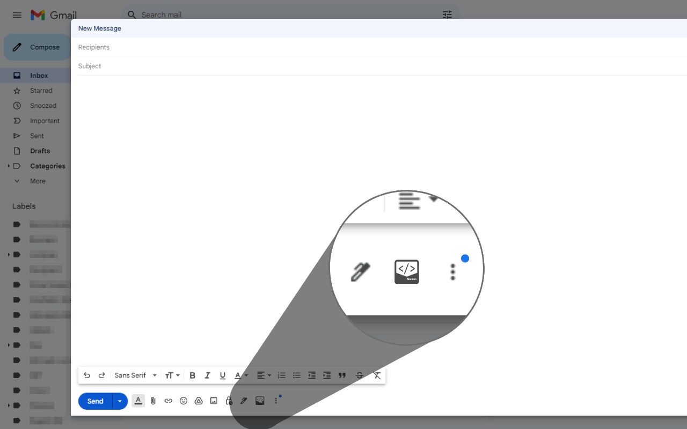

  

  <b>Insert custom HTML into Gmail, Outlook & Yahoo Mail — create stunning, professional emails with ease.</b>

<h1 align="center">MailZen</h1>

  <b>Seamlessly add HTML content to your emails in one click.</b> 
  Version 1.0.0 • Developed by <a href="https://amitdas.site">Amit Das</a>

---

## 🧩 Overview

**MailZen** is a lightweight browser extension that enables you to **insert custom HTML code** directly into your email compose window on **Gmail**, **Outlook**, and **Yahoo Mail**.  
It’s the perfect tool for developers, designers, and marketers who want more control over email formatting — **without leaving their inbox**.

---

## ⬇️ Download Extension

Get the latest version of **MailZen** from the **Chrome Web Store** or **GitHub Releases**.

  <!-- Chrome Web Store Button -->
  
  &nbsp;&nbsp;
  <!-- GitHub Download Button -->
  

### 🧭 Manual Installation Steps
1. Download the `.crx` file from the link above *(or install directly from the Chrome Web Store)*.  
2. Open `chrome://extensions/` in your Chrome browser.  
3. Enable **Developer Mode** (top right corner).  
4. Drag and drop the `.crx` file onto the page.  
5. MailZen will install automatically. ✅

---

## ⚙️ Features

✅ **Insert HTML instantly**  
- Paste or write your HTML code directly in the popup.  
- One-click preview and insertion into Gmail, Outlook, or Yahoo Mail.

✅ **Save and reuse templates**  
- Your HTML snippets are saved locally with Chrome’s storage API.

✅ **Privacy-first design**  
- No tracking, no analytics, no data collection — everything runs locally.

✅ **Beautiful, simple UI**  
- Designed for focus and speed, with a minimal and intuitive interface.

---

## 🖼️ Screenshots

### ✨ MailZen HTML Editor

---

## 🔒 Privacy & Security

Your privacy is our top priority.  
- MailZen does **not** collect, transmit, or share any personal data.  
- All preferences and HTML templates are saved **locally** using Chrome’s `storage` API.  
- No remote servers, analytics tools, or trackers are used.

Read our full [Privacy Policy](https://github.com/AmitDas4321/MailZen/blob/main/PRIVACY.md).

---

## 🧰 Permissions Used

| Permission | Purpose |
|-------------|----------|
| `storage` | Save user preferences and templates locally. |
| `tabs` | Identify and interact with the active mail compose tab. |
| `management` | Handle uninstall events and internal lifecycle checks. |

**Host Permissions:**  
`https://mail.google.com/*`  
`https://inbox.google.com/*`  
`https://mail.yahoo.com/*`  
`https://*.mail.yahoo.com/*`  
`https://outlook.live.com/*`  
`https://outlook.office.com/*`  
→ Required to insert HTML directly into supported mail compose windows.

---

## 📢 Feedback & Support

Have suggestions, ideas, or issues? We’d love to hear from you!  

📩 **Email:** [info@amitdas.site](mailto:info@amitdas.site)  
💬 **GitHub Issues:** [Report a Bug or Suggest a Feature](https://github.com/AmitDas4321/MailZen/issues)  
💡 **Feature Request Form:** [Submit your ideas here](#)

We actively review feedback to make MailZen even better with every update. 🚀

---

## 🧠 Developer Information

**Developer:** [Amit Das](https://amitdas.site)  
**GitHub:** [@AmitDas4321](https://github.com/AmitDas4321)  
**Email:** [info@amitdas.site](mailto:info@amitdas.site)  
**Location:** West Bengal, India  

Amit Das is a passionate developer and founder of multiple innovative projects like **QuickPanel**, **TextSnap**, and **PurifyYT**, focusing on building tools that simplify workflows for everyday web users and professionals.

---

## ❤️ About MailZen

MailZen was created with a simple goal — to make **HTML email creation effortless** for everyone.  
Instead of switching between editors and copying code, MailZen brings HTML design **directly into your inbox**.  

Whether you’re sending newsletters, signatures, or custom templates — MailZen helps you craft **beautiful, structured, and professional emails** in seconds.

---

## 📜 License

This extension is © 2025 **Amit Das**.  
All rights reserved. Redistribution or modification without permission is prohibited.

---

  <b>Made with ❤️ by <a href="https://amitdas.site">Amit Das</a></b> 
  ☕ Support development: <a href="https://buymeacoffee.com/amitdas4321">Buy Me a Coffee</a>

